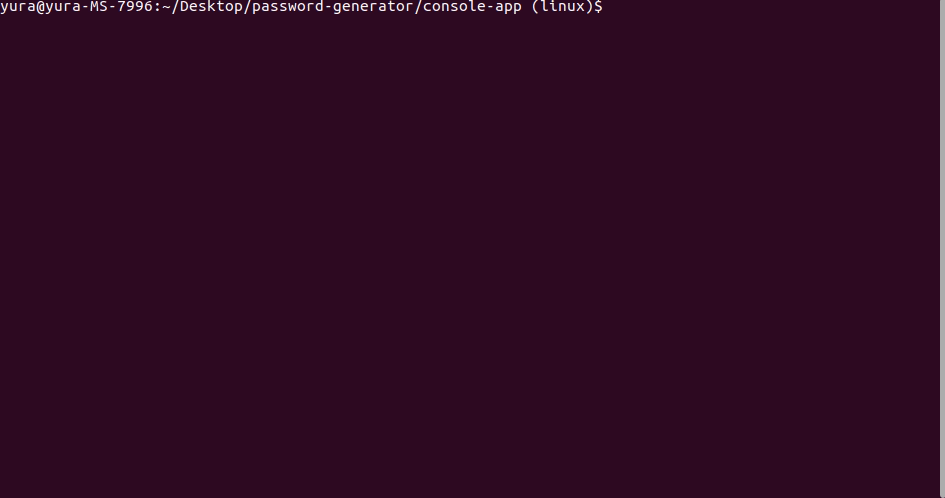
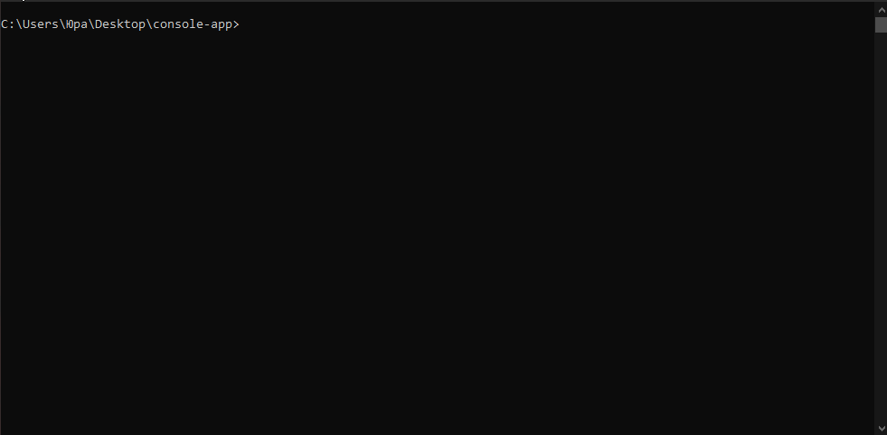

# Password Generator

An application that allows the user to enter the maximum number to generate the list of numbers and the maximum password length.
The application displays prime numbers, palindromes and the generated password from prime numbers.
The application is made in the form of a web application, a console application and a windows executable file (.exe).

---

## Web application

### Prerequisites

1. PHP 5.6 or above
2. Composer 1.10 or above

### Installation and Setup

1. Clone this repository from Github - `git clone https://github.com/jurispetrovs/password-generator.git`.
2. Go to the `web-app` folder.
3. Install Composer on the application - `composer install`.
4. Launch the project with command: `php -S localhost:8000`.
5. Open page `localhost:8000` in your browser.

---

## Console application (Linux)

### Prerequisites

1. PHP 5.6 or above

### Installation and Setup

1. Clone this repository from Github - `git clone https://github.com/jurispetrovs/password-generator.git`.
2. Go to the `console-app (linux)` folder.
3. Run the executable file with command: `php index.php`.
4. To submit parameters immediately, use the command: `php index.php 100 5`, where the first parameter is max list number (min value 10) and second parameter is max password length (min value 4).

---

## Console application (Windows)

### Prerequisites

1. Windows x86/x64

### Installation and Setup

1. Clone this repository from Github - `https://github.com/jurispetrovs/password-generator.git`.
2. Go to the `console-app (windows)` folder.
3. Run the executable file with command: `application.exe`.
4. To submit parameters immediately, use the command: `application.exe 100 5`, where the first parameter is max list number (min value 10) and second parameter is max password length (min value 4).
